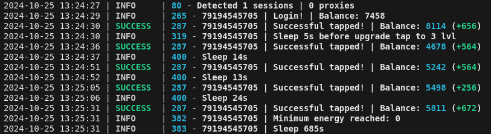

[](https://t.me/hhhscvx)



## Functionality

| Functional                                                     | Supported |
| -------------------------------------------------------------- | :-------: |
| Multithreading                                                 |    ✅     |
| Binding a proxy to a session                                   |    ✅     |
| Auto-purchase of items if you have coins (tap, energy, charge) |    ✅     |
| Auto Claiming                                                  |    ✅     |
| Random sleep time between clicks                               |    ✅     |
| Random number of clicks per request                            |    ✅     |

## [Change Settings](https://github.com/hhhscvx/PocketRocketBot/blob/master/bot/config/config.py)

| Settings              | Description                                                             |
| --------------------- | ----------------------------------------------------------------------- |
| **API_ID / API_HASH** | Platform data from which to launch a Telegram session (stock - Android) |

## Installation

You can download [**Repository**](https://github.com/hhhscvx/PocketRocketBot) by cloning it to your system and installing the necessary dependencies:

```shell
~ >>> git clone https://github.com/hhhscvx/PocketRocketBot.git
~ >>> cd PocketRocketBot

#Linux
~/PocketRocketBot >>> python3 -m venv venv
~/PocketRocketBot >>> source venv/bin/activate
~/PocketRocketBot >>> pip3 install -r requirements.txt
~/PocketRocketBot >>> cp .env-example .env
~/PocketRocketBot >>> nano .env # Here you must specify your API_ID and API_HASH , the rest is taken by default
~/PocketRocketBot >>> python3 main.py

#Windows
~/PocketRocketBot >>> python -m venv venv
~/PocketRocketBot >>> venv\Scripts\activate
~/PocketRocketBot >>> pip install -r requirements.txt
~/PocketRocketBot >>> copy .env-example .env
~/PocketRocketBot >>> # Specify your API_ID and API_HASH, the rest is taken by default
~/PocketRocketBot >>> python main.py
```

[You can change bot settings here](https://github.com/hhhscvx/PocketRocketBot/blob/master/bot/config/config.py)

Also for quick launch you can use arguments, for example:
```shell
~/YesCoinBot >>> python3 main.py --action (1/2/3)
# Or
~/YesCoinBot >>> python3 main.py -a (1/2/3)

#1 - Create session
#2 - Run clicker
```
